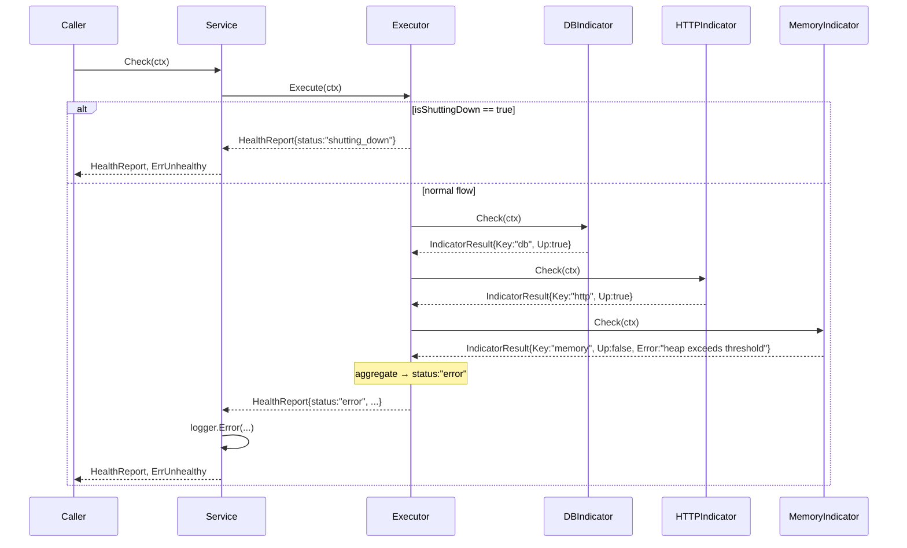

## Overview

The `health` package provides a structured health-check system for Go applications. It is inspired by the [nestjs/terminus](https://docs.nestjs.com/recipes/terminus) architecture and translated into idiomatic Go using interfaces, structs, and constructor injection — without NestJS class/module patterns.

**Request flow:**

```
Caller → Service → Executor → []Indicator
```

| Component | Role |
|-----------|------|
| `Indicator` | Contract for checking a single dependency |
| `Executor` | Runs all indicators and aggregates results |
| `Service` | Facade — calls Executor, logs failures, returns errors |
| `Up` / `Down` | Helper functions to build `IndicatorResult` |

## Installation

```bash
go get github.com/gestgo/gest/package/technique/health
go get github.com/gestgo/gest/package/technique/health/indicators
```

## Architecture

The design maps directly from nestjs/terminus:

| NestJS | Go |
|--------|-----|
| `HealthCheckService` | `Service` |
| `HealthCheckExecutor` | `Executor` |
| `*HealthIndicator` | `Indicator` interface |
| `HealthIndicatorService` | `Up()` / `Down()` helpers |
| NestJS DI container | Constructor injection |

### Sequence Diagram



## Core Concepts

### Indicator

The only interface you need to implement:

```go
type Indicator interface {
    Check(ctx context.Context) IndicatorResult
}
```

Each implementation checks exactly one dependency and returns an `IndicatorResult`. The `Key` field identifies the dependency in the final report.

### IndicatorResult

```go
type IndicatorResult struct {
    Key     string
    Up      bool
    Details map[string]any
    Error   string
}
```

Use the helper functions instead of constructing this directly:

```go
// dependency is healthy
health.Up("postgres", map[string]any{"responseTime": "3ms"})

// dependency is unhealthy
health.Down("postgres", err, map[string]any{"host": "localhost:5432"})
```

### HealthReport

The aggregated output from `Executor.Execute`:

```go
type HealthReport struct {
    Status  HealthStatus   `json:"status"`
    Info    map[string]any `json:"info,omitempty"`    // healthy indicators
    Error   map[string]any `json:"error,omitempty"`   // failing indicators
    Details map[string]any `json:"details"`            // all indicators
}
```

**Status values:**

| Value | Meaning |
|-------|---------|
| `"ok"` | All indicators passed |
| `"error"` | One or more indicators failed |
| `"shutting_down"` | App is shutting down, indicators skipped |

### Executor

Orchestrates all indicators. If `MarkShuttingDown()` has been called, `Execute` returns immediately with `StatusShuttingDown` without running any indicators.

```go
executor := health.NewExecutor(
    dbIndicator,
    httpIndicator,
    memIndicator,
)

report := executor.Execute(ctx)
```

### Service

Facade that callers (HTTP handlers, probes) interact with:

```go
svc := health.NewService(executor, logger)

report, err := svc.Check(ctx)
// err == health.ErrUnhealthy when status != "ok"
```

`Service` logs via the `Logger` interface when a check fails. Passing `nil` disables logging.

## Quick Start

### 1. Wire the components manually

```go
package main

import (
    "context"
    "database/sql"
    "fmt"
    "log"

    "github.com/gestgo/gest/package/technique/health"
    "github.com/gestgo/gest/package/technique/health/indicators"
    _ "github.com/lib/pq"
)

func main() {
    db, err := sql.Open("postgres", "postgres://localhost/myapp?sslmode=disable")
    if err != nil {
        log.Fatal(err)
    }

    executor := health.NewExecutor(
        indicators.NewDBIndicator("postgres", db),
        indicators.NewMemoryIndicator("memory", 512),
    )

    svc := health.NewService(executor, nil)

    report, err := svc.Check(context.Background())
    if err != nil {
        fmt.Printf("unhealthy: %+v\n", report)
        return
    }

    fmt.Printf("healthy: %s\n", report.Status)
}
```

### 2. Expose via HTTP (Echo example)

```go
e.GET("/health", func(c echo.Context) error {
    report, err := svc.Check(c.Request().Context())
    if err != nil {
        return c.JSON(http.StatusServiceUnavailable, report)
    }
    return c.JSON(http.StatusOK, report)
})
```

**Healthy response:**

```json
{
  "status": "ok",
  "info": {
    "postgres": {},
    "memory": { "heapUsedMB": 34, "thresholdMB": 512 }
  },
  "details": {
    "postgres": {},
    "memory": { "heapUsedMB": 34, "thresholdMB": 512 }
  }
}
```

**Unhealthy response (503):**

```json
{
  "status": "error",
  "info": {
    "memory": { "heapUsedMB": 34, "thresholdMB": 512 }
  },
  "error": {
    "postgres": { "error": "dial tcp: connection refused" }
  },
  "details": {
    "postgres": { "error": "dial tcp: connection refused" },
    "memory": { "heapUsedMB": 34, "thresholdMB": 512 }
  }
}
```

### 3. Graceful shutdown

Call `MarkShuttingDown()` before shutting down so in-flight probes return `shutting_down` instead of attempting real checks:

```go
// in your shutdown hook
svc.MarkShuttingDown()
```

## Built-in Indicators

### DBIndicator

Checks a `*sql.DB` connection via `PingContext`.

```go
import "github.com/gestgo/gest/package/technique/health/indicators"

ind := indicators.NewDBIndicator("postgres", db)
```

| Parameter | Type | Description |
|-----------|------|-------------|
| `key` | `string` | Name in the report |
| `db` | `*sql.DB` | Database connection to ping |

### HTTPIndicator

Sends a `GET` request to a URL and expects a `2xx` response.

```go
ind := indicators.NewHTTPIndicator("payment-api", "https://api.example.com/ping", nil)
// pass nil client to use http.DefaultClient
```

| Parameter | Type | Description |
|-----------|------|-------------|
| `key` | `string` | Name in the report |
| `url` | `string` | Endpoint to probe |
| `client` | `*http.Client` | HTTP client; `nil` uses `http.DefaultClient` |

**Details returned:**

```json
{ "statusCode": 200, "url": "https://api.example.com/ping" }
```

### MemoryIndicator

Checks that `runtime.MemStats.HeapAlloc` stays below a threshold (in MB).

```go
ind := indicators.NewMemoryIndicator("memory", 512) // fail if heap > 512 MB
```

| Parameter | Type | Description |
|-----------|------|-------------|
| `key` | `string` | Name in the report |
| `heapThresholdMB` | `uint64` | Maximum allowed heap in megabytes |

**Details returned:**

```json
{ "heapUsedMB": 34, "thresholdMB": 512 }
```

### DiskIndicator

Checks that disk usage on a path stays below a threshold percentage.

```go
ind := indicators.NewDiskIndicator("disk", "/", 90.0) // fail if / > 90% used
```

| Parameter | Type | Description |
|-----------|------|-------------|
| `key` | `string` | Name in the report |
| `path` | `string` | Filesystem path to check |
| `thresholdPercent` | `float64` | Maximum allowed usage percentage |

**Details returned:**

```json
{ "path": "/", "usedPercent": "72.45%", "thresholdPercent": "90.00%" }
```

## Writing a Custom Indicator

Implement the `Indicator` interface and use `Up` / `Down` to build results:

```go
package myindicators

import (
    "context"
    "fmt"

    "github.com/gestgo/gest/package/technique/health"
    "github.com/redis/go-redis/v9"
)

type RedisIndicator struct {
    key    string
    client *redis.Client
}

func NewRedisIndicator(key string, client *redis.Client) *RedisIndicator {
    return &RedisIndicator{key: key, client: client}
}

func (i *RedisIndicator) Check(ctx context.Context) health.IndicatorResult {
    if err := i.client.Ping(ctx).Err(); err != nil {
        return health.Down(i.key, err, nil)
    }
    info := i.client.Info(ctx, "server").Val()
    return health.Up(i.key, map[string]any{"info": fmt.Sprintf("%.80s...", info)})
}
```

Register it alongside built-in indicators:

```go
executor := health.NewExecutor(
    indicators.NewDBIndicator("postgres", db),
    myindicators.NewRedisIndicator("redis", redisClient),
)
```

## Logger Interface

`Service` accepts any type implementing:

```go
type Logger interface {
    Info(msg string, args ...any)
    Error(msg string, args ...any)
}
```

This is compatible with `log/slog` (`*slog.Logger`) and Uber Zap sugar (`*zap.SugaredLogger`) out of the box:

```go
// slog
svc := health.NewService(executor, slog.Default())

// zap sugar
svc := health.NewService(executor, logger.Sugar())
```

## API Reference

### Functions

| Function | Description |
|----------|-------------|
| `NewExecutor(indicators...)` | Creates an Executor with the given indicators |
| `NewService(executor, logger)` | Creates a Service; `logger` may be `nil` |
| `Up(key, details)` | Returns an `IndicatorResult` with `Up: true` |
| `Down(key, err, details)` | Returns an `IndicatorResult` with `Up: false` |

### Executor Methods

| Method | Description |
|--------|-------------|
| `Execute(ctx) HealthReport` | Runs all indicators and aggregates results |
| `MarkShuttingDown()` | Future calls to `Execute` return `StatusShuttingDown` immediately |

### Service Methods

| Method | Description |
|--------|-------------|
| `Check(ctx) (HealthReport, error)` | Returns the report; `err == ErrUnhealthy` when status is not `"ok"` |
| `MarkShuttingDown()` | Delegates to the underlying Executor |

### Errors

| Error | Description |
|-------|-------------|
| `ErrUnhealthy` | Returned by `Service.Check` when status is `"error"` or `"shutting_down"` |
